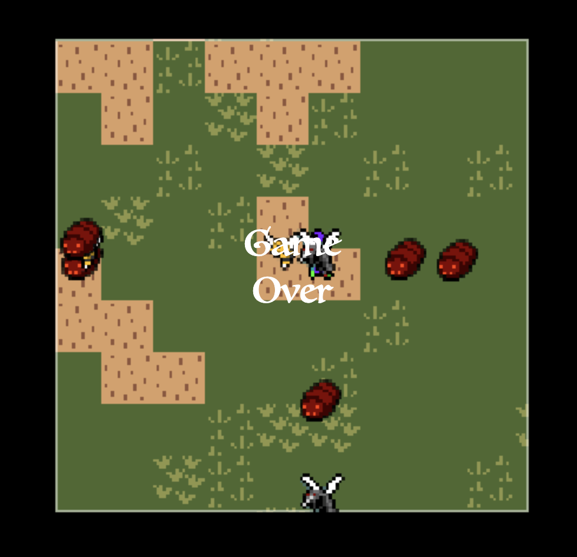

# codingwizard

## Overview

Coding Wizard is a 16 bit 2d tile-based role player game made entirely from scratch in vanilla JavaScript, HTML5, and CSS3. 
The user plays as a coding wizard that can cast spells to defeat evil bugs in the developed universe.


[Check Out the Live Site Here!](https://justinlieu06.github.io/codingwizard/)

## Features
The game allows the player to move around in the viewport, and destroy bugs via using spells that are casted by clicking.
Bugs respawn on a random part of the map's edge.
Scoring is based off of how the player interacts with the world.


### Viewport
The map and game entities are contained inside a viewport which moves with the player. The player sprite is unable
to escape the viewport since the focus is on the player sprite, but other entities like enemies can exist outside 
of the viewport.

### Enemies
The map initially spawns evil bugs on random locations of the map. Upon killing a bug, the bug will respawn in a
random part of the map's edge. The bugs will always travel the fastest route towards the player. Upon touching the
player, the bug will despawn, but the player's score will decrease and the player will lose a life.

### Fireball
The player can cast fireballs by clicking on the map. The fireball's trajectory is based off of where the player clicks
in relation to their character sprite. The fireball will move away from the player sprite until it hits the edge of the
viewport where it will be destroyed or until it hits a bug where it will destroy the bug and increment the player's score.

### Trail
As the coding wizard moves around the map, he leaves a trail based off of where he has traveled. For each tile the wizard
moves, the player's score is incremented, and the map adds more to the trail.

### Start / Game Over Screen
The game begins upon pressing the start button. When the player reaches 0 lives, the game ends, and the game over screen will pop up.



## Code Snippets

Constantly recalculate each bug's center point so that when bug collides with player, code will decrease the life and score of the player, remove the bug from the array, and then respawn the bug.

```
for (let i = 0; i < bugArr.length; i++){
  let currentBug = bugArr[i];

  let bugXCenter = Math.floor((currentBug.x + scaledSize * 0.5) / scaledSize);
  let bugYCenter = Math.floor((currentBug.y + scaledSize * 0.5) / scaledSize) * columns;

  if (currentBug.velocityX === 0 && currentBug.velocityY === 0){
    score -= 10;
    scoreDiv.innerHTML = score;
    lives -= 1;
    livesDiv.innerHTML = lives;
    bugArr.splice(i, 1);
    //spawn new bug
    respawnBug();
  }
}
```
Bug will respawn on a random part of the map edges. Code needs to randomly determine x and y coordinates, and manipulate such cartesian coordinates, based on the viewport, in order to make sure such coordinate remain on the map's edges.

```
function respawnBug(){
  let xOrY = Math.floor(Math.random() * 2);
  let randI;
  let randJ;
  if (xOrY){
    randI = 0;
    randJ = Math.floor(Math.random() * rows);
  } else {
    randI = Math.floor(Math.random() * columns);
    randJ = 0;
  }
  let tileXCoor = Math.floor(randI * scaledSize - viewport.x + mapXCoor);
  let tileYCoor = Math.floor(randJ * scaledSize - viewport.y + mapYCoor);

  let bugSpriteRand = Math.floor(Math.random() * 4);
  let bugSpeedRand = 0.4;

  bugArr.push(new Bug(tileXCoor, tileYCoor, bugSpeedRand, bugSpriteRand, 1, 1));
}
```

Delete the fireball if it leaves the map's edge at any point.

```
currentFireball.update(fireballXDir, fireballYDir);
if (currentFireball.x > scaledLeftMapEdge && currentFireball.x < scaledRightMapEdge && 
  currentFireball.y > scaledTopMapEdge && currentFireball.y < scaledBottomMapEdge){
  context.drawImage(fireballSprites, currentFireball.fireballSpriteNum * spriteSize, 0, spriteSize, 
   spriteSize, currentFireball.x, currentFireball.y, scaledSize, scaledSize);
} else {
  fireballArr.splice(i, 1);
}
```

## Potential Future Features

* More spells
* Prevent player from going in water or leaving map
* More bug sprites
* Collectable loot
* Sounds
